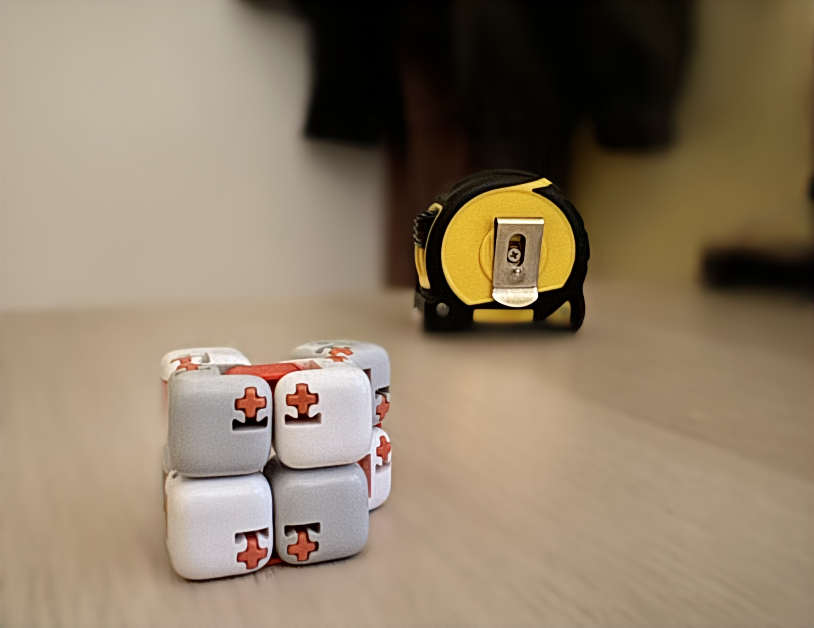

# Eye tracking saliency

## Saliency

### Setup

1. Clone TranSalNet repository

```bash
   git clone https://github.com/LJOVO/TranSalNet.git
```

2. Download pretrained models [TranSalNet repository](https://github.com/LJOVO/TranSalNet) and place them in `TranSalNet/pretrained_models/`:

- `TranSalNet_Dense.pth`
- `TranSalNet_Res.pth`

3. In `TranSalNet/utils/` add

```
from torch.hub import load_state_dict_from_url
```

in `densenet.py` and `resnet.py` files.

### Result - Dense


### Result - Res


## Bokeh

### Setup

1. Clone PyNET-Bokeh repository

```bash
   git clone https://github.com/aiff22/PyNET-Bokeh.git
   mv PyNET-Bokeh PyNET_Bokeh
```

2. Download pretrained models:

- [VGG-19](https://download.ai-benchmark.com/s/CCDiWM2sE25x2dW/download/imagenet-vgg-verydeep-19.mat) model and put it into vgg_pretrained/ folder.
- [PyNET](https://download.ai-benchmark.com/s/RQXWD3eg5gSXLMa/download/PyNET_Bokeh_pretrained.zip) model and put it into models/original/ folder.

### Result


